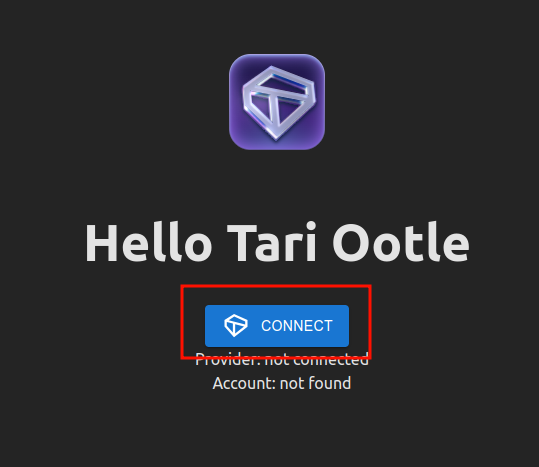

# The Hello Ootle Tapplet

This is an _hello world_ tapplet for testing purposes only. All you can do here is connect to the `TariProvider` and check the status of your user account. Just like that.

## Provide configuration in .env file

Copy the `.env.example` file to `.env` and edit the correct environment variable values.

## Run the application

To run the web:

```shell
npm install
npm run dev
```

### Connect to your wallet

Click on `Connect` button on the top right corner, choose `WalletConnect` option.



Copy the connection id by clicking on copy icon on the top right corner.


Go to your wallet and click `Connect with WalletConnect` button.
A dialog will appear asking you to approve the connection.


Authorize it on the next screen.


Now you should be connected. Go back to application and the connection button now should read `Connected`.
